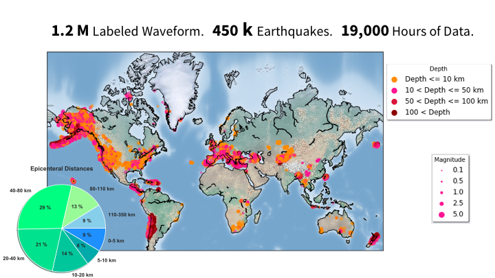
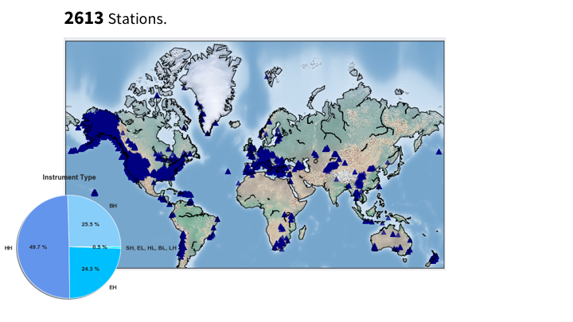
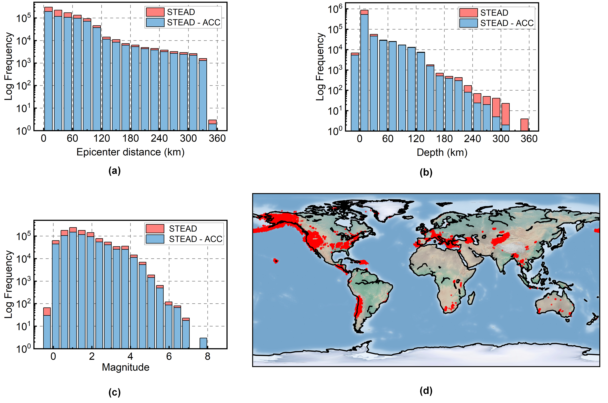
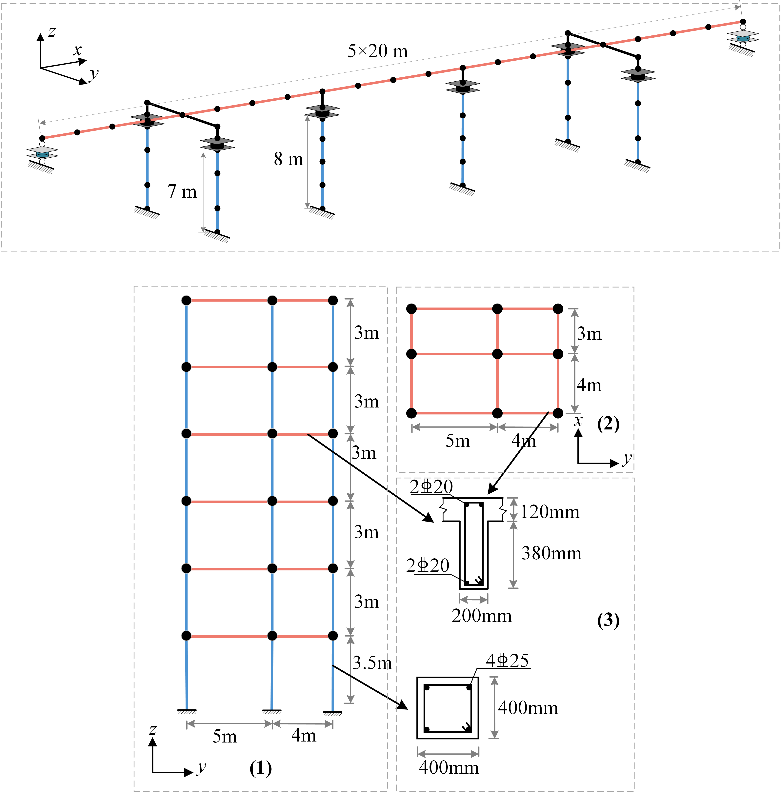

# Selection of the structural severest design ground motions based on big data and random forest

<p align="center">
 
</p>

## 1 How to get the STanford EArthquake Dataset - ACC

### 1.1 Go to https://github.com/smousavi05/STEAD and Download the dataset of meta data.

-----------------------------------------
Here is some information of origin dataset.





https://www.youtube.com/watch?v=Nn8KJFJu-V0

----------------------------------------- 

### 1.2 Get inventory data from IRIS station and transform meta data to Acc

We provide the program to get the inventory data and transform the orgin data to
acc data.

See dir "meta2acc":

 ```Python
"""
This code file should run independently, so the function in it is organized together.
"""
import time
import pandas as pd
import numpy as np
import h5py
import obspy
from obspy import UTCDateTime
from obspy.clients.fdsn.client import Client


def get_quake_name(csv_file, condition=""):
    """
    Founction of quake wave selecting.Only provide the 'trace_name' for selected results.
    :param file_name: The quake file's name.
    :param condition: The searching condition with type 'str'.
    :return: Selected list with 'trace_name'
    """
    # reading the csv file into a dataframe
    df = pd.read_csv(csv_file, low_memory=False)
    print(f"total events in csv file: {len(df)}")
    # filterering the dataframe, adding the condition
    if condition == "":
        df = df[df.trace_category == "earthquake_local"]
    else:
        df = df[((df.trace_category == "earthquake_local") & eval(condition))]
    print(f'total events selected: {len(df)}')

    # making a list of trace names for the selected data
    # the keyword must be 'trace_name' because it's primary
    ev_list = df['trace_name'].to_list()

    # the 'ev_list' just save the 'trace_name' data as list
    return ev_list


def make_stream(dataset):
    """
    Obspy is very
    input: hdf5 dataset
    output: obspy stream
    """
    data = np.array(dataset)

    tr_E = obspy.Trace(data=data[:, 0])
    tr_E.stats.starttime = UTCDateTime(dataset.attrs['trace_start_time'])
    tr_E.stats.delta = 0.01
    tr_E.stats.channel = dataset.attrs['receiver_type'] + 'E'
    tr_E.stats.station = dataset.attrs['receiver_code']
    tr_E.stats.network = dataset.attrs['network_code']

    tr_N = obspy.Trace(data=data[:, 1])
    tr_N.stats.starttime = UTCDateTime(dataset.attrs['trace_start_time'])
    tr_N.stats.delta = 0.01
    tr_N.stats.channel = dataset.attrs['receiver_type'] + 'N'
    tr_N.stats.station = dataset.attrs['receiver_code']
    tr_N.stats.network = dataset.attrs['network_code']

    tr_Z = obspy.Trace(data=data[:, 2])
    tr_Z.stats.starttime = UTCDateTime(dataset.attrs['trace_start_time'])
    tr_Z.stats.delta = 0.01
    tr_Z.stats.channel = dataset.attrs['receiver_type'] + 'Z'
    tr_Z.stats.station = dataset.attrs['receiver_code']
    tr_Z.stats.network = dataset.attrs['network_code']

    stream = obspy.Stream([tr_E, tr_N, tr_Z])

    return stream


def get_inventory_bulk(file_number):
    """
    Get inventory data from IRIS station and save as txt.
    """
    # Write file name of the meta DataSet Here
    quake_file = "Z:/STEAD/ch" + str(file_number) + "/chunk" + str(file_number) + ".csv"
    h5py_file = "Z:/STEAD/ch" + str(file_number) + "/chunk" + str(file_number) + ".hdf5"
    # Acc data saving dir
    chunk_acc = "Z:/STEAD/chunk" + str(file_number) + "_acc.hdf5"
    ev_list = get_quake_name(quake_file)
    dtfl = h5py.File(h5py_file, 'r')
    acc = h5py.File(chunk_acc, "a")
    length = len(ev_list)
    step = 1000

    for i in range(8000, length, step):
        bulk = []
        start_time = time.time()
        print("--------------------epoch %d--------------------" % (i / step))

        for j in range(step):
            # Get quake_set in each epoch
            print("\rSolving bulk: %d/%d" % (j + 1, step), end="")
            quake_wave_set = dtfl.get('data/' + str(ev_list[i + j]))
            bulk.append((quake_wave_set.attrs["network_code"], quake_wave_set.attrs["receiver_code"], "*", "*",
                         UTCDateTime(quake_wave_set.attrs["trace_start_time"]),
                         UTCDateTime(quake_wave_set.attrs["trace_start_time"]) + 60))

        print("\nSolved.")
        print("Getting station data from IRIS...")
        client = Client("IRIS")
        start_time_station = time.time()
        inventory_bulk = client.get_stations_bulk(bulk, level="response")
        print("Cost %.2f s to apply stations bulk from IRIS." % (time.time() - start_time_station))
        print("Data got.")

        for j in range(step):
            print("\rAnalysing and writing data: %d/%d" % (j + 1, step), end="")
            quake_wave_set = dtfl.get('data/' + str(ev_list[i + j]))
            st = make_stream(quake_wave_set)

            try:
                st = st.remove_response(inventory_bulk, output="ACC", plot=False)
                quake_acc = np.array(st)
                # In ev_list, it's the trace_name of data.
                acc.create_dataset(ev_list[i + j], data=quake_acc, dtype="float64")

            except Exception as e:
                with open("log.txt", "a") as fp:
                    now_time = time.ctime()
                    logmsg = str(now_time) + " " + str(e) + " epoch" + str(i / step) + "(" + str(j) + ")" + "\n"
                    print(logmsg)
                    fp.write(logmsg)

        print("\nOver.")
        end_time = time.time()
        print("Used time %.2f s." % (end_time - start_time))

    return None


if __name__ == "__main__":
    get_inventory_bulk(5)
 ```

1) We suggest obtaining the raw dataset from https://github.com/smousavi05/STEAD first, followed by obtaining the
   instrument response data from IRIS using the above code, and finally converting the raw data to acc data.

2) Sending data requests to IRIS can be implemented directly using the Python package, and we recommend requesting
   instrument response data for 1000 seismic waves at once, and then requesting it again after it has been processed at
   the
   terminal. After relevant tests, the download speed of data requested in this way is very fast.

3) After applying to get the acc data, some of the seismic wave data were lost, in this study, the statistics of the
   original data and the obtained ACC data are as follows.



### 1.3 Acc to Intensity Measures

In addition, we provide some seismic wave processing functions to facilitate the extraction of seismic
*_Intensity Measures_* data

Please see file [data_process.py](mlStaticTargetPredBridge/Code/data_process.py)

```Python
class IntensityMeasure:
    def __init__(self, quake_waves=None, default_features=None):
        """
        Input the quake_waves with size (batch_size,seq_len)
        Output the normalized intensity measures with size (batch_size,features_num)
        features_list = ['$PGA$', '$PGV$', '$PGD$', '$RMSA$', '$RMSV$', '$RMSD$', '$I_A$',
                         '$ASI$', '$VSI$', '$HI$', '$SMV$', '$Sa(T1)$', '$Sv(T1)$', '$T70$']
        :param quake_waves: ndarray
        """
        super(IntensityMeasure, self).__init__()
        self.time_step = 0.02
        self.batch_size = quake_waves.shape[0]
        self.seq_len = quake_waves.shape[1]
        self.quake_waves_a = quake_waves
        self.quake_waves_v = None
        self.quake_waves_d = None
        if default_features:
            self.default_features = default_features
        else:
            self.default_features = ['PGA', 'PGV', 'PGD', 'RMSA', 'RMSV', 'RMSD', 'I_A', 'I_C', 'SED', 'CAV',
                                     'ASI', 'VSI', 'HI', 'SMA', 'SMV', 'Ia', 'Id', 'Iv',
                                     'If', 'Sa(T1)', 'Sv(T1)', 'Sd(T1)', 'T70', 'T90', 'FFT']
        self.params = {}

    def get_params_array(self):
        """
        Change the params dict into ordered array
        :return:
        """
        if not self.params:
            raise ValueError("There is no param in dict, run 'make_intensity_measure_file' first.")
        else:
            result = np.zeros((self.batch_size, len(self.default_features)))
            for i in range(len(self.default_features)):
                result[:, i] = self.params[self.default_features[i]]
            return result

# The following is omitted
```

## 2. Opensees Model

The two opensees Model used in this research is as follows:

1) [Bridge](openseesModels/Bridge/eaii.tcl)

2) [Building](openseesModels/Building/EXAM7.tcl)



## 3. Machine learning Models

After obtaining the seismic [_**Intensity Measures**_](#1-how-to-get-the-stanford-earthquake-dataset---acc) and seismic
[_**Demand Measures**_](#2-opensees-model), the code related to
seismic intensity prediction under big data by machine learning method is stored
in [mlStaticTargetPredBridge](mlStaticTargetPredBridge) and [mlStaticTargetPredBuilding](mlStaticTargetPredBuilding).
We provide the relevant [data](mlStaticTargetPredBuilding/Data) files and [code](mlStaticTargetPredBridge/Data) files
used in this study.

----------------------------------------- 
Reference:
```commandline
Xiaohong Long, Chunde Lu, Xiaopeng Gu, Yongtao Ma, Zonglin Li,
Selection of the structural severest design ground motions based on big data and random forest,
Engineering Applications of Artificial Intelligence,
Volume 133, Part B,2024,108238,https://doi.org/10.1016/j.engappai.2024.108238.
```
BibTex:
```BibTex
@article{LONG2024108238,
title = {Selection of the structural severest design ground motions based on big data and random forest},
journal = {Engineering Applications of Artificial Intelligence},
volume = {133},
pages = {108238},
year = {2024},
issn = {0952-1976},
doi = {https://doi.org/10.1016/j.engappai.2024.108238}
}
```
-----------------------------------------